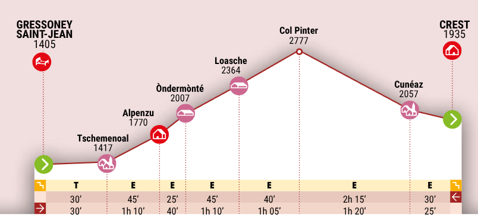

# Tappa 10: Da Rifugio Barmasse a Rifugio Cuney 

## 📊 Dati principali

| Parametro KOMOOT | Valore |
|---|---|
| Difficoltà | Difficile |
| Distanza | 16.3 km |
| Durata stimata | 7:48 h |
| Velocità media | 2.1 km/h |
| Dislivello positivo (salita) | 1230 m |
| Dislivello negativo (discesa) | 770 m |

| Parametro ALTA_VIA_Pdf | Valore |
|---|---|
| Durata stimata | 6:15 h |
| Dislivello positivo (salita) | 1233 m |
| Dislivello negativo (discesa) | 770 m |

---
## 🌄 Panoramica

Dopo una giornata quasi interamente di relax, è giunto il momento di usare le energie immagazzinate; prendi lo zaino, si parte!

Procedi in direzione delle due borgate di Cortina, Superiore ed Inferiore, e da lì sali al colle Fenêtre d'Ersaz, da dove si ha un panorama sorprendente sul Cervino e le vette di Valtournenche.

Continui saliscendi ti portano ad attraversare alpeggi e piccoli agglomerati di case in pietra fino a condurti al Bivacco Luca Reboulatz, posto a pochi passi dal Lago di Luseney. Puoi fermarti qui per sgranocchiare il tuo panino o una barretta. Davanti al bivacco trovi una fontana per riempire la borraccia.

Raggiungi il Col Terray e poi l’Oratorio di Cuney, un luogo affascinante e ricco di storia. È il rifugio più alto delle Alte Vie della Valle d’Aosta e si trova di fianco al santuario di Cunéy, uno dei più alti d’Europa, nonché meta di pellegrinaggi. In questo angolo di paradiso puoi godere di un'incredibile vista su tutti i più importanti giganti delle Alpi, dalla Svizzera al Piemonte: non c’è miglior modo per concludere la giornata!

---
## 🚩 Punti di passaggio (waypoints)

| Punto | Distanza dall'inizio | Descrizione |
|---|---|---|
| A | 0 km | Punto di partenza |
| 1 | 4.17 km | **Colle Fenêtre d'Ersaz** – Passo Montano. La Fenêtre d’Ersaz si trova a 2.290 metri d'altitudine. Da qui si ha una vista impagabile sul Cervino e sulle cime della Valtournenche. I sentieri che portano qui sono tecnicamente facili e non troppo ripidi. |
| 2 | 11.5 km | **Bivacco Luca Reboulaz** – Rifugio. Il bivacco è stato costruito nel 1993 ed è dedicato a Luca Reboulaz un amante della montagna che perse la vita sulla Becca del Luseney. È posto in un luogo davvero incantevole! |
| 3 | 11.8 km | **Lago di Luseney** – Lago. Il lago di Luseney è un bellissimo bacino di origine glaciale. Si trova a poca distanza dal bivacco Luca Reboulaz. |
| 4 | 16.3 km | **Rifugio e Oratorio di Cuney** – Rifugio. Rifugio Oratorio di Cuney è il rifugio più alto delle Alte Vie della Valle d’Aosta: si trova a 2.652 metri di altitudine. Da qui si possono ammirare il Monte Rosa, il Gran Paradiso e il Rutor. Vicino è posto il santuario della Madonna delle Nevi. |
| B | 16.3 km | Punto di arrivo |

---
## 🥾 Tipi di percorso

| Tipo di percorso | Lunghezza |
|---|---|
| Sentiero escursionistico alpino | 10.3 km |
| Sentiero escursionistico alpino | 3.9 km |
| Sentiero | 1.53 km |
| Sentiero escursionistico | 570 m |

---
## 🏔️ Superfici

| Superficie | Lunghezza |
|---|---|
| Naturale | 5.19 km |
| Alpino | 9.28 km |
| Non asfaltata | 901 m |
| Sterrato | 919 m |

---
## ⛰️ Salite e discese

| Segmento | Pendenza | Dislivello | Lunghezza |
|---|---|---|---|
| Salita  | 18 % | 349 m | 1.95 km |
| Salita  | 8 %  | 123 m | 1.55 km |
| Salita  | 15 % | 122 m | 808 m |
| Salita  | 13 % | 247 m | 1.84 km |
| Salita  | 12 % | 227 m | 1.93 km |
| Salita  | 11 % | 145 m | 1.33 km |
| Discesa | 10 % | 226 m | 2.24 km |
| Discesa | 21 % | 203 m | 963 m |
| Discesa | 17 % | 143 m | 838 m |
| Discesa | 15 % | 115 m | 743 m |

---
## ⛺ Punti di sosta e pernottamento
[Pernottamento](../../Rifugi/N1/Pernottamento_13_08_2026.md)

---
## 🍺 Punti recupero cibo 

---
## Fonti
**Fonte 1:** [KOMOOT](https://www.komoot.com/it-it/tour/832112199)
**Fonte 2:** [ALTA-VIA_Pdf](../../Pdf/ITA_FRA_Alte_Vie.pdf)
