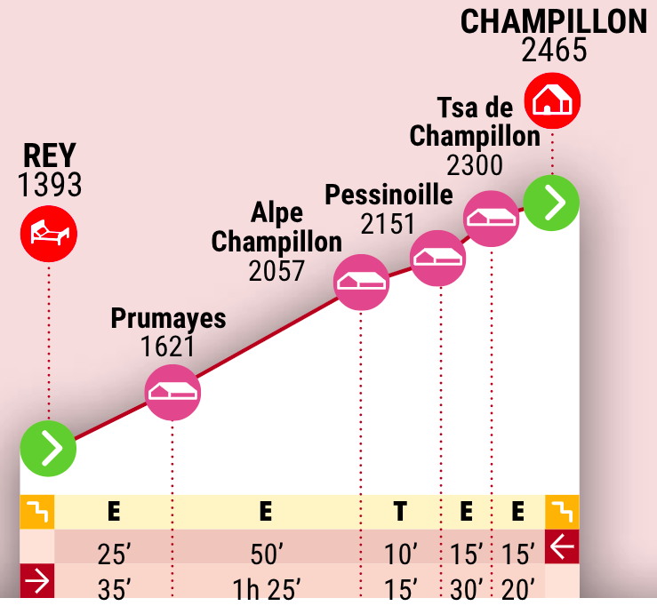

# Tappa 13: Da Rey a Rifugio Champillon

## 📊 Dati principali

| Parametro KOMOOT | Valore |
| :--------------: | :----: |
| Difficoltà | Difficile |
| Distanza | 5.58 km |
| Durata stimata | 3:14 h |
| Velocità media | 1.7 km/h |
| Dislivello positivo (salita) | 1040 m |
| Dislivello negativo (discesa) | 0 m |
| Traccia GPX | [Traccia](GPX/N1/Tappa%2013_%20Da%20Ollomont%20al%20Rifugio%20LВtey%20Champillon.gpx) |

| Parametro ALTA_VIA_Pdf | Valore |
| :--------------------: | :----: |
| Durata stimata | 3:05 h |
| Dislivello positivo (salita) | 1038 m |
| Dislivello negativo (discesa) | 0 m |

---
## 🌄 Panoramica

La tredicesima tappa è corta, ma senz’altro impegnativa. Lasciati alle spalle Ollomont e dirigiti verso il bosco di conifere.

Il tragitto di oggi è caratterizzato da una forte pendenza e dalla presenza di diversi alpeggi. Uscendo dal bosco puoi osservare in lontananza vette frastagliate, il bianco acceso dei ghiacciai e macchie verdi di vegetazione sui pendii delle montagne.

Poco oltre la metà del percorso ti trovi davanti all’Alpe di Champillon, dove è presente anche una fontana. Qui puoi fare una piccola pausa per riposare le gambe in vista dell’ultimo tratto.

Un ultimo sforzo ed eccoti al Rifugio Letey-Champillon, da cui puoi godere di un ottimo panorama sul vallone di Ollomont e sulla Bassa Valpelline.

---
## 🚩 Punti di passaggio (waypoints)

| Punto | Distanza dall'inizio | Descrizione |
|---|---|---|
| A | 0 km | **Punto di partenza** |
| 1 | 3.24 km | **Verso Champillon** – Punto Panoramico. Il sentiero sale ripido fino a Champillon regalando bellissimi scorci sulle montagne circostanti. |
| 2 | 5.58 km | **Rifugio Champillon** – Monumento naturale. Il Rifugio Letey-Champillon si trova in un punto molto panoramico sul vallone di Ollomont e sulla Bassa Valpelline. È dedicato a Adolphe Letey, sindaco di Doues, che credette molto nel turismo e nelle potenzialità di questo territorio. |
| B | 5.58 km | **Punto di arrivo** |

---
## 🥾 Tipi di percorso

| Tipo di percorso | Lunghezza |
| :--------------: | :-------: |
| Sentiero escursionistico alpino | 3.30 km |
| Sentiero | 1.17 km |
| Strada | 689 m |
| Sentiero escurionistico | 397 m |

---
## 🏔️ Superfici

| Superficie | Lunghezza |
| :--------: | :-------: |
| Naturale | 3.27 km |
| Alpino | 1.56 km |
| Asfalto | 663 m |
| Sterrato | <100 m |
| Lastricato | <100 m |

---
## ⛰️ Salite e discese

| Segmento | Pendenza | Dislivello | Lunghezza |
| :------: | :------: | :--------: | :-------: |
| Salita  | 21 % | 1030 m | 4.9 km |

---
## ⛺ Punti di sosta e pernottamento
[Pernottamento](../../Rifugi/N1/Pernottamento_15_08_2026.md)

---
## 🍺 Punti recupero cibo 

---
## Fonti
**Fonte 1:** [KOMOOT](https://www.komoot.com/it-it/tour/832112199)
**Fonte 2:** [ALTA-VIA_Pdf](../../Pdf/ITA_FRA_Alte_Vie.pdf)
