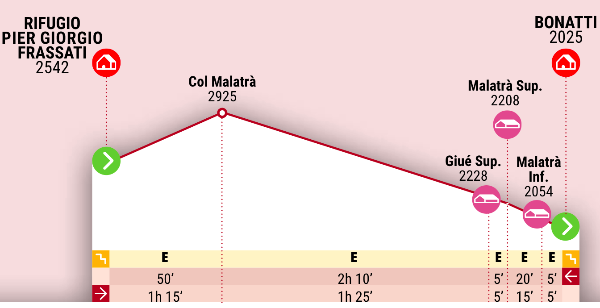
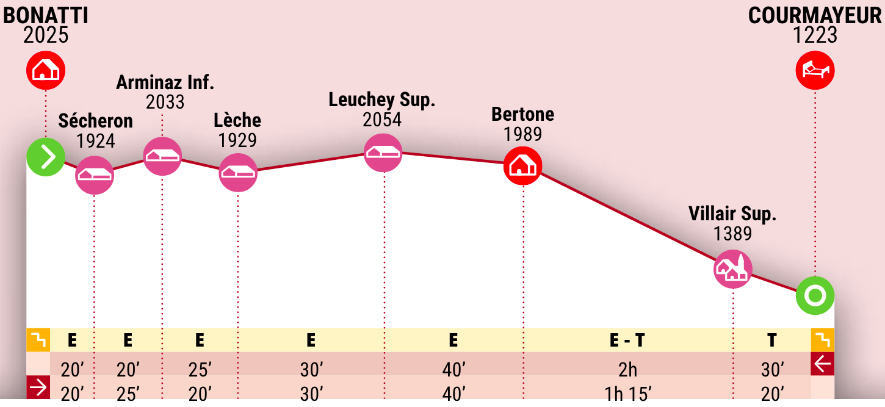

# Tappa 16: Da Rifugio Pier Giorgio Frassati a Rifugio Walter Bonatti 

## 📊 Dati principali

| Parametro KOMOOT | Valore |
| :--------------: | :----: |
| Difficoltà | Difficile |
| Distanza | 7.99 km |
| Durata stimata | 3:46 h |
| Velocità media | 2.1 km/h |
| Dislivello positivo (salita) | 350 m |
| Dislivello negativo (discesa) | 860 m |
| Traccia GPX |[Traccia](GPX/N1/Tappa%2016_%20Dal%20Rifugio%20Frassati%20al%20Rifugio%20Bonatti.gpx) |

| Parametro ALTA_VIA_Pdf | Valore |
| :--------------------: | :----: |
| Durata stimata | 3:05 h |
| Dislivello positivo (salita) | 430 m |
| Dislivello negativo (discesa) | 903 m |

---
## 🌄 Panoramica

La tappa di oggi ti conduce fin da subito in un luogo molto iconico: il Col de Malatrà. Zaino in spalla e intraprendi questa prima salita a uno dei valichi più significativi del Tor des Géants, la gara di ultra-trail più famosa d’Italia e una delle più importanti a livello mondiale.

Il passo si trova a 2.925 metri d’altitudine e pare scavato tra le rocce frastagliate. Per coloro che partecipano alla competizione, toccare questo luogo equivale ad aver concluso tutte le salite più difficili e dover fare i conti con una lunga discesa verso Courmayeur. Per te anche significa aver fatto praticamente tutto il dislivello positivo della giornata, ma, a differenza loro, puoi goderti in santa pace il panorama che ti circonda e lentamente prepararti alla discesa.

Sotto il colle il sentiero corre tra gli sfasciumi, quindi è bene fare attenzione a dove si mettono i piedi; presto però il fondo roccioso lascia spazio ad ampie praterie alpine con una vista a dir poco spaziale sul Monte Bianco. Il paesaggio dal Vallone di Malatrà toglie il fiato, quindi perché non concedersi una pausa?

Ultimo tratto in discesa ed eccoti al Rifugio Walter Bonatti, dedicato a uno dei più grandi alpinisti di tutti i tempi. Anche da qui la vista sul Monte Bianco è sensazionale, pare quasi di toccarlo con la punta delle dita. Arrivare fin qui ne vale sicuramente la fatica!

---
## 🚩 Punti di passaggio (waypoints)

| Punto | Distanza dall'inizio | Descrizione |
|---|---|---|
| A | 0 km | **Punto di partenza** |
| 1 | 2.12 km | **Col de Malatrà** – Passo Montano. Il Col de Malatrà è un luogo simbolo delle Alte Vie della Valle d'Aosta; il Monte Bianco viene incorniciato dalle rocce frastagliate del colle. Per chi gareggia nel Tor des Geants, invece, rappresenta l'ultimo grande sforzo prima della lunga discesa verso Courmayeur. |
| 2 | 6.31 km | **Vallone di Malatrà** – Gola.Questo vallone ti rapisce per la sua immensa bellezza: è impossibile non fermarsi a contemplare la natura, i ghiacciai e tutta la magnificenza che ti circonda. |
| 3 | 7.99 km | **Rifugio Walter Bonatti** – Rifugio. Il Rifugio Alpino Walter Bonatti prende il nome dal famoso alpinista italiano. Costruito nel 1988, il rifugio offre una vista mozzafiato sul Monte Bianco e sulla sua catena di cime. È il luogo perfetto per una pausa durante il percorso alpino. La cucina casalinga e l'atmosfera accogliente contribuiscono a rilassare chiunque vi sosti. |
| B | 7.99 km | **Punto di arrivo** |

---
## 🥾 Tipi di percorso

| Tipo di percorso | Lunghezza |
| :--------------: | :-------: |
| Sentiero escursionistico alpino | 5.95 km |
| Sentiero escursionistico alpino | 1.55 km |
| Sentiero escursionistico | 466 m |

---
## 🏔️ Superfici

| Superficie | Lunghezza |
| :--------: | :-------: |
| Alpino | 7.50 km |
| Non asfaltata | 466 m |

---
## ⛰️ Salite e discese

| Segmento | Pendenza | Dislivello | Lunghezza |
| :------: | :------: | :--------: | :-------: |
| Salita  | 15 % | 332 m | 2.20 km |
| Discesa | 19 % | 528 m | 2.81 km |
| Discesa | 12 % | 335 m | 2.73 km |

---
# Tappa 17: Da Rifugio Walter Bonatti a Courmayer 

## 📊 Dati principali

| Parametro KOMOOT | Valore |
| :--------------: | :----: |
| Difficoltà | Difficile |
| Distanza | 12.0 km |
| Durata stimata | 4:35 h |
| Velocità media | 2.6 km/h |
| Dislivello positivo (salita) | 200 m |
| Dislivello negativo (discesa) | 1010 m |
| Traccia GPX | [Traccia](GPX/N1/Tappa%2017_%20Dal%20Rifugio%20Bonatti%20a%20Courmayeur.gpx) |

| Parametro ALTA_VIA_Pdf | Valore |
| :--------------------: | :----: |
| Durata stimata | 3:50 h |
| Dislivello positivo (salita) | 183 m |
| Dislivello negativo (discesa) | 1024 m |

---
## 🌄 Panoramica

Eccoti all’ultima tappa dell’Alta Via della Valle d’Aosta 1: un viaggio lungo, impegnativo, a dir poco mozzafiato. Anche nella giornata di oggi non mancheranno panorami sorprendenti, quindi bando alle ciance, scarponi ai piedi e si parte!

Il sentiero scende leggermente e ti conduce all’alpeggio Sécheron prima e all’Arminaz Inferiore poi; corre tra i rododendri e giunge al Rifugio Giorgio Bertone. Da qui puoi vedere in basso la meta della giornata, Courmayeur, e a monte il re dei re, il Monte Bianco, che ti accompagnerà fino all’ultimo passo di questa avventura. Se desideri, puoi fermarti qui per il pranzo.

L’ultima discesa, un po’ più ripida delle precedenti, ti conduce nel cuore pulsante di Courmayeur. Lungo il cammino i panorami mozzafiato sulle vette circostanti sono all’ordine del minuto.

A Courmayeur non ti resta che festeggiare con un buon tagliere e i piatti tipici della tradizione valdostana: la fatica dev’essere ripagata senza sconti!

Da qui puoi raggiungere in bus Aosta e da lì prendere un treno per le diverse località italiane.

---
## 🚩 Punti di passaggio (waypoints)

| Punto | Distanza dall'inizio | Descrizione |
|---|---|---|
| A | 0 km | **Punto di partenza** |
| 1 | 7.32 km | **Vista sul massiccio del Monte Bianco** – Punto Panoramico. In questo punto si ha una bellissima vista su gran parte del massiccio del Monte Bianco. Il ghiaccio, i seracchi pensili sono di particolare effetto. Mozzafiato! |
| 2 | 7.62 km | **Rifugio Giorgio Bertone** – Rifugio. Il rifugio Giorgio Bertone si trova a quota 2.000 m. La cornice è splendida, con Courmayeur e le cime circostanti a fare da sfondo. Possibilità di soggiornare in mezza pensione (dormitorio o camera) e di mangiare. |
| 3 | 7.79 km | **Vista su Courmayeur e sul monte Chetif** – Punto Panoramico. Qui abbiamo una vista molto bella sia su Courmayeur che sul Mont Chétif. |
| 4 | 12 km | **Courmayeur** – Insediamento. Courmayeur è un paese molto famoso e frequentato perché posto ai piedi del celeberrimo Monte Bianco. Lungo le sue vie si trovano piccole botteghe, negozi sportivi e ristoranti che servono i piatti tipici della tradizione valdostana. |
| B | 12 km | **Punto di arrivo** |

---
## 🥾 Tipi di percorso

| Tipo di percorso | Lunghezza |
| :--------------: | :-------: |
| Sentiero escursionistico alpino | 9.76 km |
| Strada | 1.22 km |
| Strada secondaria | 393 m |
| Sentiero escursionistico | 312 m |
| Marciapiede | 148 m |
| Sentiero | 129 m |
| Sentiero escursionistico alpino | <100 m |

---
## 🏔️ Superfici

| Superficie | Lunghezza |
| :--------: | :-------: |
| Alpino | 7.76 km |
| Non asfaltata | 2.69 km |
| Lastricato | 1.41 km |
| Naturale | <100 m |
| Sconosciuta | <100 m |

---
## ⛰️ Salite e discese

| Segmento | Pendenza | Dislivello | Lunghezza |
| :------: | :------: | :--------: | :-------: |
| Salita  | 10 % | 71 m | 711 m |
| Discesa | 13 % | 65 m | 521 m |
| Discesa | 8 % | 54 m | 656 m |
| Discesa | 17 % | 821 m | 4.84 km |

---

## ⛺ Punti di sosta e pernottamento
[Pernottamento](../../Rifugi/N1/Pernottamento_17_08_2026.md)

---
## 🍺 Punti recupero cibo 

---
## Fonti
**Fonte 1:** [KOMOOT](https://www.komoot.com/it-it/tour/832112199)
**Fonte 2:** [ALTA-VIA_Pdf](../../Pdf/ITA_FRA_Alte_Vie.pdf)
